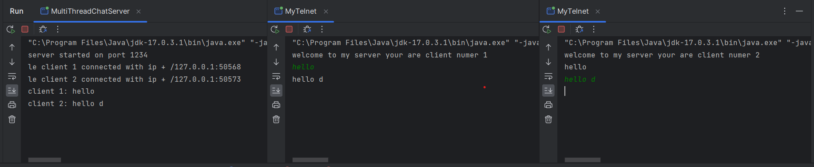
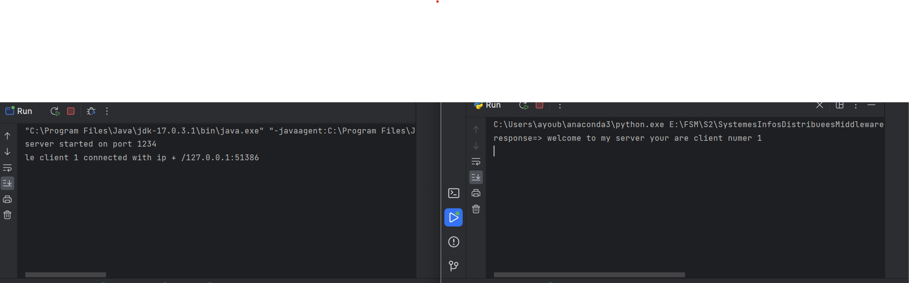
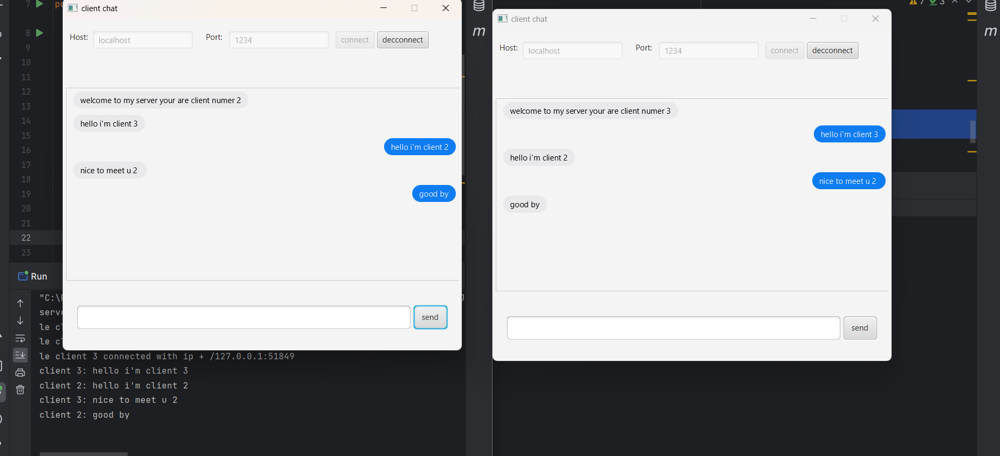

# Network Programming 

**This repo contains 3 directory `sockets` `socketsWithPython` `clientChatJavaFx` each one refers to a project that simulate a chat servers with clients**

## sockets Directory 

sockets Directory is a java project contains 2 packages _blocking_ and _nonblocking_  
> the blocking package contains several classes including **SimpleServer** **SimpleClient** 
**MultiThreadChatServer** all thos classes use java.io which mean the data exchange happen in a synchron way thats why we use the multiThreading aspect to make it asynchron  

> The nonblocking package contains the class **SingleThreadNonBlockingServer** that use a new way to make data exchange asynchron which is java.nio  
### Execution ScreenShots:

## socketsWithPython
socketsWithPython is a client chat with python 

### Execution Screenshots:
  

## clientChatJavaFx 
clientChatJavaFx is a client chat use graphic interface to connect and chat in a server 
### Execution ScreenShots:

